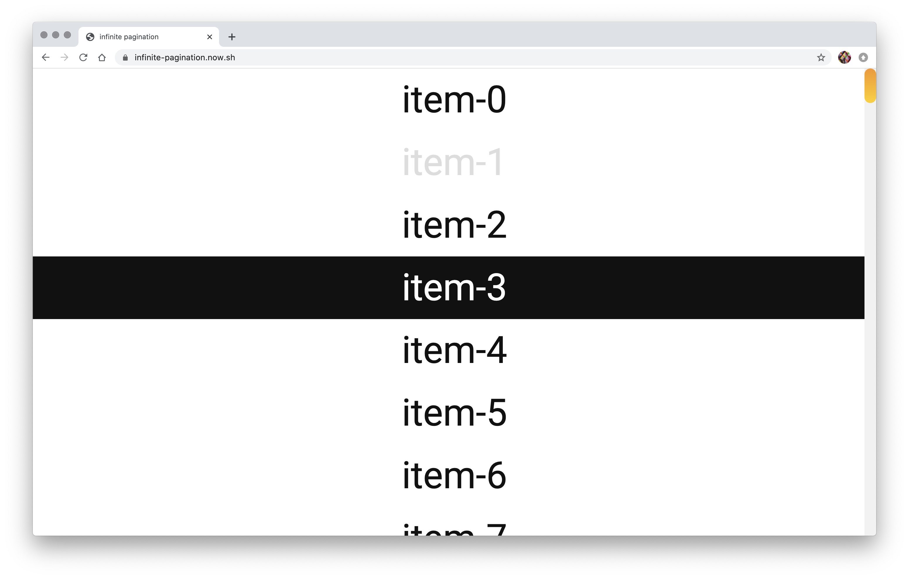

# Infinite Pagination

This is a single page app with infinite pagination. It lists all the items available in the legacy API in an infinite scrolling page. Whenever the user clicks in one of the items, the item becomes greyed out and it persists even after refreshing the page.

## 👀 Preview

https://infinite-pagination.now.sh/



## 🚀 Quick start

1. Download the project and cd into it:

   ```bash
   git clone https://github.com/junagao/infinite-pagination.git
   cd infinite-pagination
   ```

2. Install dependencies and run the application:

   ```bash
   yarn
   yarn dev
   ```

3. Open your browser and navigate to:

   http://localhost:8080/

## 📚 Tech Stack

- React 16
- Hooks
- Emotion (+ emotion-theming)
- Axios
- Webpack 4
- Babel 7
- Hot Module Replacement
- ESLint (airbnb styleguide)
- Prettier
- Husky
- lint-staged
- Jest
- React Testing Library

## Author

Juliane Nagao - [GitHub](https://github.com/junagao) - [LinkedIn](https://www.linkedin.com/in/junagao/)

## License

This project is licensed under the MIT License.
